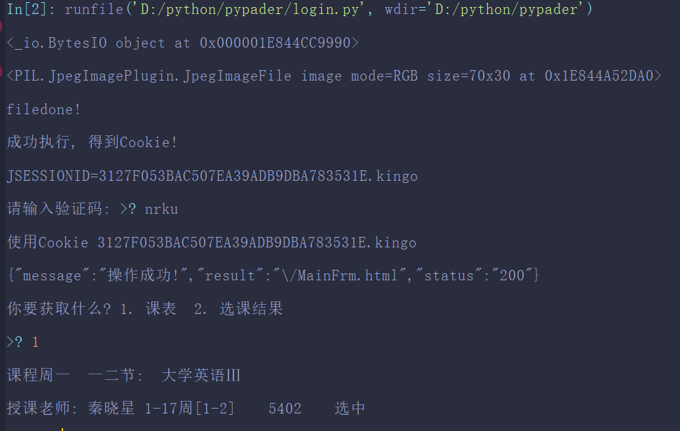
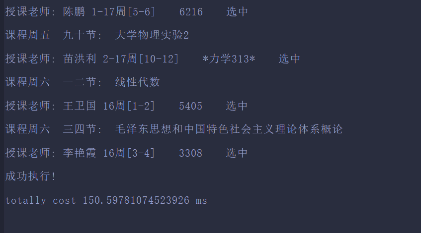
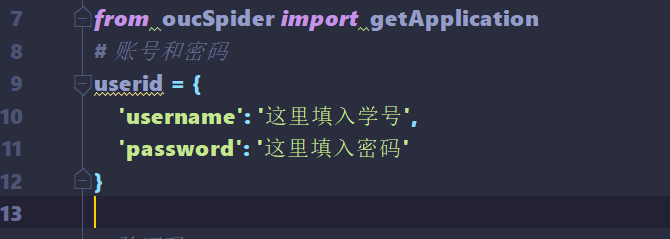
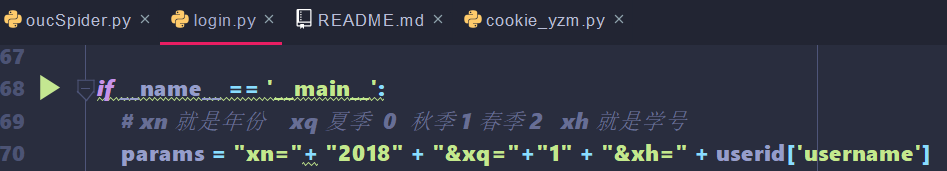

# Python 爬取中国海洋大学课表

## 一份简单的使用说明（`一贯秉持开源精神，故此开源`）

> #### 这个是干嘛的 `模拟登录教务处， 获取课表` 既然都能登录进去了， 其它功能也好做了。

### [博客教程]()：有计划写， 但是最近忙， 过几天可能更新， 分析一下技术原理

### 初学python 语法上有点low 但是功能还是可以实现的

> #### 因为之前使用Nodejs, 爬虫，好不容易写好了， 可是我这个菜鸟，不知道如何
> ####同步异步， 导致执行顺序的问题，解决不了。。。
> #### 所以现学现用使用python做了一个

一个多月前写的， 放着也是放着， **如何运行** 填入学号， 密码后 可以在login.py 直接运行 默认本学期课程

## 效果展示

## `后面可能会写一份教程， 分析一下教务处网站的爬取`

## 使用时在login的userid中输入你的jwc账号密码

### ` 特别Tips:  ` 为了加快速度， 提高性能， 验证码文件没有保存在本地，不进行io操作， 而是通过直接操作内存的方式， 并且使用PIL将其绘制出来

> ### main函数在login.py 在其中有个字符串输入参数
> ### # xn 就是年份    xq 夏季  0  秋季 1 春季 2   xh 就是学号

### `一点缺陷` 时间原因最近比较忙, 没有做把cookie存下来的操作, 这样造成了多次请求,
### 数据没有存到数据库中， 小问题， 没时间做先不做了，连一下数据库， 几个循环的事而已
### 不过没关系， 大体都做完了 这点应该很简单了
### 'PS', 如何你做了， 欢迎PR！ 看到后将会合并你的代码。

## `important` 学校垃圾教务处系统年份显示混乱 如果得不到内容就是年份减一年
## 比如请求2019 春季学期 却要输入 2018 春季 // 秋季和夏季貌似没问题

#### *`一位不愿意透露姓名的 zz OUCer Coder`*
